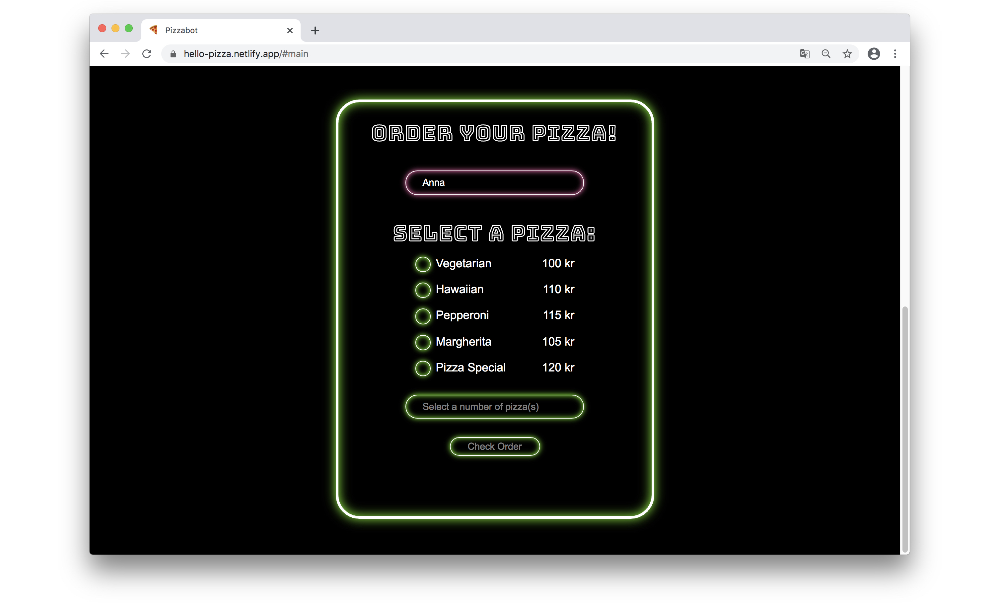

# Pizza Bot&ensp;|&ensp;[View Live &#10132;](https://hello-pizza.netlify.app/)

A pair programming assignment to create a text-based bot that orders pizza. One person is the Driver that writes the code while the other acts as Navigator and reviews and plan ahead. Learning to solve problems together and how to complement each other as programmers.

A Technigo introduction to JavaScript with functions, arguments and conditionals.

## Core Tech

- HTML5
- JavaScript ES6
- CSS3

## Screenshot

## View it live

https://hello-pizza.netlify.app/
